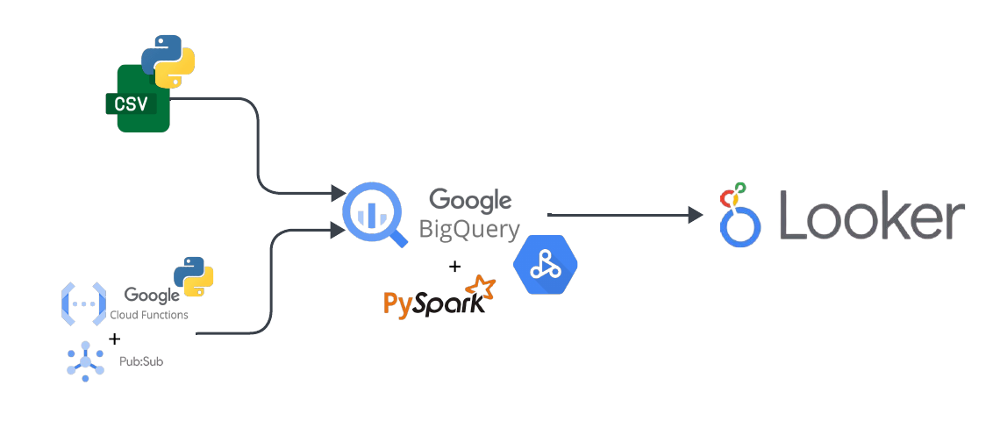
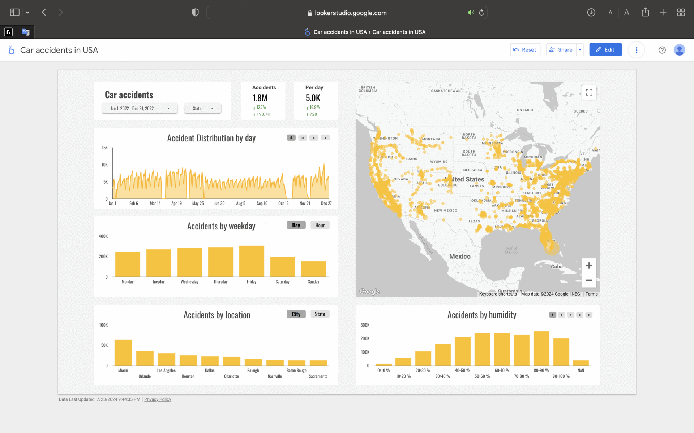

# 💥🚗 USA Accidents Data Engineering Project

## 🔎 Overview

This project is a comprehensive data engineering solution for analyzing accident data in the USA from 2016 to 2023. The dataset, sourced from Kaggle, is processed through a series of steps to simulate a real-world data pipeline, incorporating data ingestion, transformation, and visualization. The data processing is performed using Google Cloud Dataproc.



## 🌳 Project Structure

```bash
.
├── README.md
├── __init__.py
├── app
│   ├── __init__.py
│   ├── jobs
│   │   ├── __init__.py
│   │   ├── accidents_job.py
│   │   └── aggregates
│   │       ├── __init__.py
│   │       └── functions.py
│   └── main.py
├── fake_pub_sub_on_gcp
│   ├── README.md
│   ├── consumer.py
│   ├── producer.py
│   ├── requirements_consumer.txt
│   └── requirements_producer.txt
├── images
│   ├── car_accidents_dashboard.gif
│   └── project.png
└── scheduled_queries
    ├── aggregates_to_one_table.sql
    └── load_new_data_to_curated_layer.sql
```

## 📚 Dataset

This is a countrywide car accident dataset that covers 49 states of the USA. The accident data were collected from February 2016 to March 2023, using multiple APIs that provide streaming traffic incident (or event) data. These APIs broadcast traffic data captured by various entities, including the US and state departments of transportation, law enforcement agencies, traffic cameras, and traffic sensors within the road networks. The dataset currently contains approximately 7.7 million accident records.
Link to data:

[US Accidents (2016 - 2023)](https://www.kaggle.com/datasets/sobhanmoosavi/us-accidents)

## ➜ Data Pipeline

### Data Ingestion
* Fake Pub/Sub: Simulates streaming data using a Pub/Sub mechanism.
* Load Raw Table: Ingests data into the raw table for initial storage.
### Raw Layer
The raw table stores the ingested data in its original form without any transformations. This layer acts as the first step in the data pipeline.

### Curated Layer
A scheduled query transforms the data from the raw table to the curated table. The curated table has well-defined data types and structures, making it suitable for further processing.

### Aggregation Tables
Using Google Cloud Dataproc, the data from the curated table is processed to create aggregation tables. These tables contain summarized data that can be used for various analytical purposes.

### Visualization
## [Car_accidents_usa_2016_to_2023](https://lookerstudio.google.com/reporting/f94c8c40-0bc8-455b-a626-ece2d334b964)



The final step involves visualizing the data using Looker. The visualizations provide insights into accident trends, weather conditions, and other critical factors.

## 📝 Scripts and Functions

## Aggregation Functions
The functions.py script contains all neccessary functions to transform data to desired structure.

### Main Script
The main.py script orchestrates the entire data pipeline, calling the necessary functions and ensuring the smooth flow of data from ingestion to visualization.

### Scheduled Queries
The `scheduled_queries` folder contains the scheduled queries used to transform data between the raw and curated layers and union all aggregation tables.

## ✅ Setup and Execution

### Prerequisites
* Python 3.x
* Google Cloud Platform account
* Google Cloud SDK
* PySpark
* Looker


## ⚙️ Run Pyspark via Dataproc
- Clone the project
Informations about: [Submit a job via Dataproc](https://cloud.google.com/dataproc/docs/guides/submit-job)

Command to run Pyspark via Cloudshell:
```bash
  $  gcloud dataproc jobs submit pyspark --jars gs://spark-lib/bigquery/spark-3.1-bigquery-0.28.0-preview.jar --cluster YOUR_CLUSTER_NAME --region REGION_NAME gs://PATH/TO/YOUR/FILE/MAIN.PY
```
Command to run Pyspark via Dataproc terminal:
```bash
  $  spark-submit --jars gs://spark-lib/bigquery/spark-3.1-bigquery-0.28.0-preview.jar home/PATH/TO/YOUR/FILE/MAIN.PY
```

_______________________________________________________________________
## ⚙️ Run Pyspark locally
If you want to run Pyspark locally:
- Clone the project
- Download bigquery jar and put it in project directory
- Replace jar localisation to your localisation of jar file
- Go to the app folder in project directory:
Type in CLI:
```bash
  $  spark-submit --jars path/to/file/spark-3.1-bigquery-0.28.0-preview.jar --files main.py --job airports_job
```
